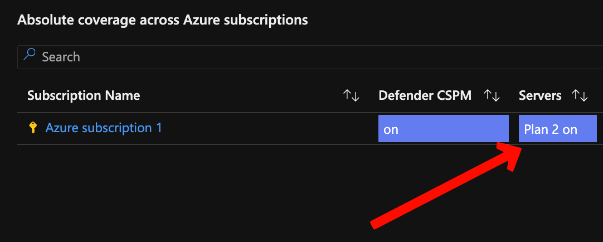
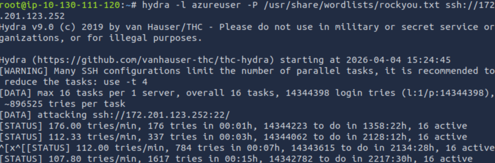
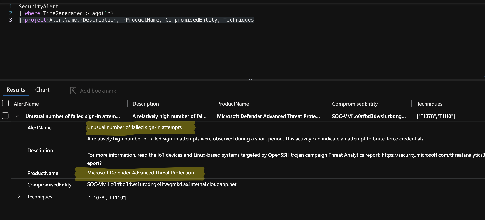
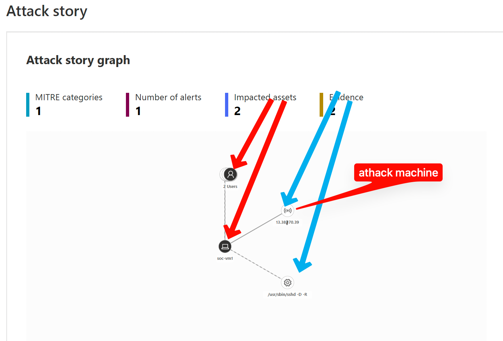
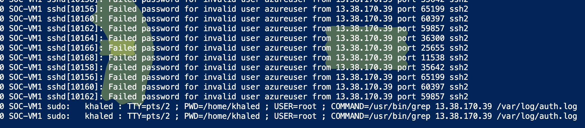
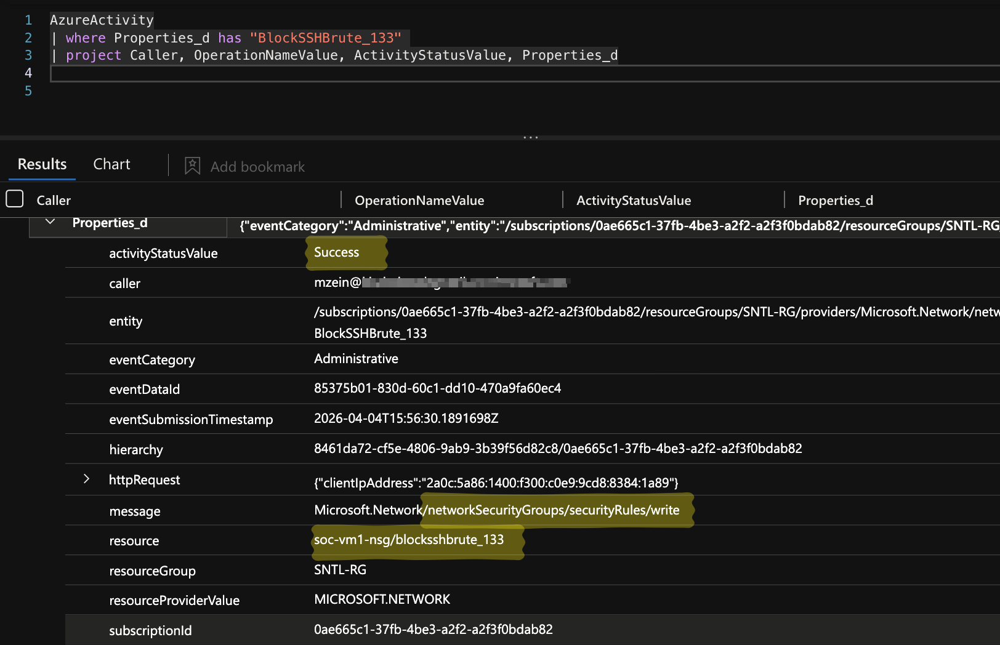
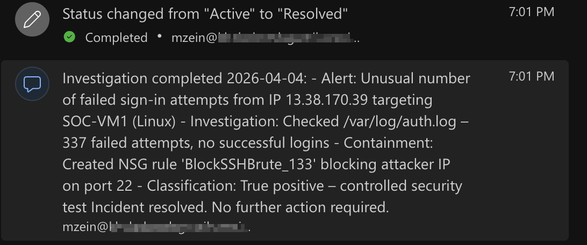

# Brute-Force-Detection-and-Containment-Using-Sentinel and Defender

---

## 🎯 Project Objective

Simulated a realistic SSH brute-force attack against an Azure Linux VM and executed the full incident response lifecycle using **Microsoft Defender for Servers Plan 2** and **Microsoft Sentinel**. The goal was to demonstrate practical SOC skills in detection, investigation, containment, and response in a cloud environment.

---

## 🛠️ Tools Used
- Microsoft Defender for Servers Plan 2
- Microsoft Sentinel (SIEM)
- Azure Activity Logs + KQL
- Azure Network Security Groups (NSG)
- Advanced Hunting
- **Claude (Anthropic)** – Used for report structuring, professional writing, and layout optimization

---

## 🏗️ Lab Environment
- **Cloud:** Microsoft Azure
- **VM:** Ubuntu 22.04 LTS — Standard B1s
- **SIEM:** Microsoft Sentinel (Log Analytics Workspace)
- **Attack Machine:** Hydra on local Kali Linux
- **Defender Plan:** Microsoft Defender for Servers Plan 2

---

## Skills Demonstrated
- Defender for Servers configuration and monitoring
- Real-time threat detection using KQL queries
- Incident investigation using Attack Story Graph
- Automated and manual containment actions
- Custom detection and response workflows
- Professional incident documentation and reporting with AI assistance

---

## Project Walkthrough

### 1. Defender for Servers Plan 2 Setup
Enabled Microsoft Defender for Servers Plan 2 on the target Linux VM, connecting it to the Log Analytics workspace. This activates Defender's agentless scanning, file integrity monitoring, and security alert forwarding to Microsoft Sentinel — generating the SecurityAlert and SecurityEvent tables used for detection.

### 2. Target VM Creation
Created the target Azure Linux VM and monitored its creation using KQL query in the `AzureActivity` table to track control-plane changes.

### 3. Brute Force Attack Simulation
Executed a controlled SSH brute-force attack using Hydra from a Kali Linux environment.

### 4. Detection in Microsoft Sentinel
Microsoft Defender for Servers triggered an alert. Used a custom KQL query to hunt and confirm the latest security alerts.

### 5. Investigation - Attack Story
Analyzed the full attack chain using the Attack Story Graph in Sentinel.

### 6. VM Authentication Logs Review
Reviewed detailed authentication logs to understand the brute-force pattern and confirm the scale of the attack.

### 7. Containment Action
Blocked the attacker IP by creating a Network Security Group (NSG) rule. Verified the action using KQL against the `AzureActivity` table.

### 8. Incident Resolution
Successfully resolved the incident with final comments and documentation.

---

## MITRE ATT&CK Mapping

| Tactic                  | Technique ID       | Technique Name                          | Description |
|-------------------------|--------------------|-----------------------------------------|-------------|
| Reconnaissance          | T1595.002         | Active Scanning: Vulnerability Scanning | External scanning of exposed SSH port |
| Credential Access       | T1110.003         | Brute Force: Password Spraying          | SSH brute-force attack using Hydra |
| Defense Evasion         | T1562.001         | Impair Defenses                         | Attempt to bypass monitoring |
| Command & Control       | T1071            | Application Layer Protocol              | Potential C2 if successful |

---

## Lessons Learned
- Internet-facing Linux VMs generate brute-force attempts within minutes of creation. This lab VM received real SSH attempts from external IPs before Hydra even ran, confirming that default-open port 22 is actively scanned in the wild.
- NSG rules restricting SSH to known IPs should be default, not optional.
- Combining Defender for Servers with Sentinel provides excellent visibility and automated response capabilities.
- **AI Integration (Claude)**: Used Claude to help structure reports, improve technical writing, and optimize layout — demonstrating modern SOC practices where AI assists analysts in producing high-quality, professional documentation efficiently.

---

**Author:** Mohamed Khaled Mohamed Zein  
**Date:** April 2026  

---
